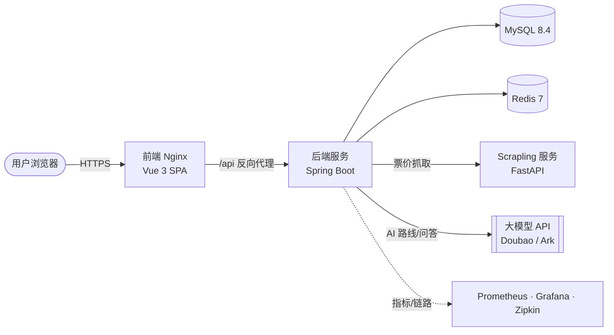

<div align="center">

# 七彩西藏 · Colorful Tibet

**面向西藏文旅场景的企业级全栈应用平台**

景点导览 · AI 路线规划 · 酒店预订 · 订单中心 · 路线社区 · 非遗文化 · 智能问答

<br/>

[](LICENSE)
[](backend/pom.xml)
[](backend/pom.xml)
[](frontend/package.json)
[](frontend/package.json)
[](docker-compose.yml)
[](docker-compose.yml)
[](docker-compose.yml)

</div>

---

## 目录

- [项目概述](#项目概述)
- [核心能力](#核心能力)
- [系统架构](#系统架构)
- [技术栈](#技术栈)
- [环境要求](#环境要求)
- [快速开始](#快速开始)
- [本地开发](#本地开发)
- [配置说明](#配置说明)
- [可观测性与健康检查](#可观测性与健康检查)
- [测试与质量保障](#测试与质量保障)
- [部署](#部署)
- [项目结构](#项目结构)
- [安全](#安全)
- [贡献指南](#贡献指南)
- [许可证](#许可证)
- [文档索引](#文档索引)

---

## 项目概述

**七彩西藏（Colorful Tibet）** 是一个面向西藏旅游场景的全栈 Web 应用平台，覆盖从内容展示、智能行程规划到交易履约的完整业务闭环。系统采用前后端分离架构，前端通过统一的 `/api` 网关访问后端服务，生产环境由 Nginx 托管前端并反向代理后端接口。

平台在设计上强调 **安全合规、可观测、可水平部署**：内置 JWT 鉴权、CSRF 防护、接口限流、设备指纹、行为校验、敏感信息加密（PII）与生产环境强密钥校验，并通过 Actuator + Prometheus + Grafana + Zipkin 构建完整的指标与链路追踪体系。

| | |
| --- | --- |
| **定位** | 西藏文旅一体化服务平台 |
| **架构** | 前后端分离 + 微服务化票价抓取 + 容器化部署 |
| **当前版本** | `1.0.0` |
| **开源协议** | Apache License 2.0 |
| **代码仓库** | [suli9710/colorful-tibet](https://github.com/suli9710/colorful-tibet) |

---

## 核心能力

| 业务域 | 能力说明 |
| --- | --- |
| **景点服务** | 景点浏览、详情、热力图、个性化推荐、票价定时更新 |
| **AI 行程规划** | AI 路线生成、流式路线输出、路线收藏与社区分享 |
| **酒店与预订** | 酒店列表、详情、房型查询、在线预订与订单管理 |
| **订单中心** | 统一订单聚合、支付回调（支持本地 Mock）、状态流转 |
| **非遗文化** | 非遗内容、传承人、活动、评论与点赞互动 |
| **内容生态** | 新闻资讯、首页轮播、藏语词典、旅行问答、用户个人中心 |
| **智能问答** | AI 导游对话（支持匿名与登录用户的分级配额与防滥用） |
| **管理后台** | 用户、景点、路线、酒店、非遗、新闻与社区内容的统一治理 |
| **安全能力** | JWT、CSRF、限流、设备指纹、行为校验、PII 加密、强密钥校验 |
| **运维能力** | Docker Compose 编排，集成 MySQL、Redis、监控与告警组件 |

---

## 系统架构



平台由以下服务组成（端口为本地 `docker-compose.yml` 默认映射）：

| 服务 | 技术 | 职责 | 本地访问 |
| --- | --- | --- | --- |
| `frontend` | Vue 3 + Nginx | 单页应用，反向代理 `/api`、`/uploads`、图片资源 | `http://localhost` |
| `backend` | Spring Boot | 业务 API、鉴权、安全、AI 编排、定时任务 | `http://localhost:8080` |
| `mysql` | MySQL 8.4 | 主数据库，Flyway 管理 schema 迁移 | `127.0.0.1:3307` |
| `redis` | Redis 7 | 缓存、限流、配额与防暴破计数 | `127.0.0.1:6380` |
| `scrapling` | FastAPI | 景点票价抓取微服务 | `http://localhost:8000` |

> 生产环境额外提供 Prometheus、Grafana、Alertmanager、Zipkin 等监控组件，详见 [`monitoring/`](monitoring) 与部署文档。

---

## 技术栈

**后端**

- Java 17、Spring Boot 3.5.12
- Spring Security + JWT、Spring Data JPA、Flyway
- MySQL 8.4、Redis 7
- Spring Boot Actuator + Micrometer（Prometheus 指标）

**前端**

- Vue 3、Vite 8、TypeScript
- Pinia、Vue Router、vue-i18n
- Tailwind CSS、Axios、ECharts、Leaflet

**部署与运维**

- Docker Compose、Nginx
- Prometheus、Grafana、Alertmanager、Zipkin
- Scrapling / FastAPI 票价抓取微服务

---

## 环境要求

容器化运行只需具备 Docker 环境；本地分离式开发建议安装对应工具链。

| 组件 | 版本要求 | 用途 |
| --- | --- | --- |
| Docker / Docker Compose | 最新稳定版 | 一键启动全部服务 |
| JDK | 17 | 后端编译与运行 |
| Maven | 3.9+ | 后端依赖与构建 |
| Node.js | 20+ 或 22+ | 前端开发与构建 |
| MySQL | 8.x | 本地分离式开发时的数据库 |
| Redis | 7.x | 本地分离式开发时的缓存 |

---

## 快速开始

### 方式一：Docker Compose（推荐）

适用于完整体验或集成验证，一键拉起前端、后端、MySQL、Redis 与 Scrapling。

```bash
# 1. 复制环境变量模板
cp .env.example .env

# 2. 编辑 .env，替换所有 change-me / replace-with-* 占位值
#    生产环境务必使用强随机密钥，不可沿用示例值

# 3. 构建并启动
docker compose up -d --build

# 4. 查看运行状态
docker compose ps
```

启动后可访问：

| 入口 | 地址 |
| --- | --- |
| 前端 | http://localhost |
| 后端健康检查 | http://localhost:8080/actuator/health/readiness |
| Scrapling 健康检查 | http://localhost:8000/health |

停止服务：

```bash
docker compose down
```

> Windows 用户可使用项目自带脚本 `./start.ps1` 与 `./stop.bat`，详见[本地开发部署文档](docs/DEPLOYMENT.md)。

### 方式二：本地分离式开发

详见下方 [本地开发](#本地开发)。

---

## 本地开发

适用于日常开发调试，前后端分别启动并支持热更新。

**前端**

```bash
cd frontend
npm install
npm run dev
```

Vite 默认运行在 http://localhost:5173 ，并将 `/api`、`/images`、`/uploads` 代理到后端 http://localhost:8080 。

**后端**

```bash
cd backend
mvn -q -DskipTests compile

# 使用 local 配置启动（需先准备 MySQL 与 Redis，并配置必要环境变量）
SPRING_PROFILES_ACTIVE=local mvn spring-boot:run
```

后端默认监听 `8080` 端口。本地开发需提供数据库连接与安全密钥等环境变量，具体见 [配置说明](#配置说明)。

---

## 配置说明

所有运行时配置通过环境变量注入，集中维护在根目录 [`.env.example`](.env.example) 中。生产环境必须使用强随机密钥。

| 变量 | 说明 |
| --- | --- |
| `SPRING_PROFILES_ACTIVE` | 运行环境，开发常用 `local`，生产使用 `prod` |
| `VITE_API_BASE_URL` | 前端 API 基础路径，默认 `/api` |
| `MYSQL_DATABASE` / `MYSQL_USERNAME` / `MYSQL_PASSWORD` | 本地 Compose 的 MySQL 配置 |
| `DB_NAME` / `DB_USERNAME` / `DB_PASSWORD` | 生产 profile 的数据库配置 |
| `REDIS_HOST` / `REDIS_PORT` / `REDIS_PASSWORD` | Redis 连接配置 |
| `JWT_SECRET` | JWT 签名密钥，生产要求 64 字符以上 |
| `CSRF_SIGNING_SECRET` | CSRF Cookie 签名密钥 |
| `PII_KEYS` / `PII_ACTIVE_KID` | 敏感信息加密密钥集合与当前 Key ID |
| `ADMIN_ENCRYPTION_KEY` | 管理端敏感配置加密密钥 |
| `SUPER_ADMIN_USERNAME` / `SUPER_ADMIN_TOTP_SECRET` | 超级管理员账号与 TOTP 二次认证密钥 |
| `DOUBAO_API_KEY` / `ARK_API_KEY` | AI 路线生成与智能问答所需的大模型 API Key |
| `VITE_AMAP_KEY` / `VITE_AMAP_SECURITY_CODE` | 高德地图前端配置 |
| `CORS_ALLOWED_ORIGINS` | 允许的跨域来源，生产应配置正式域名 |
| `NGINX_SERVER_NAME` / `NGINX_CERT_DOMAIN` | 生产 Nginx 域名与证书目录名 |

> 完整变量清单与默认值请参阅 [`.env.example`](.env.example) 及[部署配置治理说明](docs/deployment-configuration.md)。

---

## 可观测性与健康检查

| 能力 | 端点 / 说明 |
| --- | --- |
| 后端 API 前缀 | `/api` |
| 健康检查（就绪态） | `/actuator/health/readiness` |
| Prometheus 指标 | `/actuator/prometheus` |
| OpenAPI 文档 | `/swagger-ui.html`（是否公开由 `PUBLIC_DOCS_ENABLED` 控制） |
| 前端容器健康检查 | `/health` |
| 链路追踪 | Zipkin（采样率由 `TRACING_SAMPLING_PROBABILITY` 控制） |
| 指标看板与告警 | Prometheus + Grafana + Alertmanager，配置见 [`monitoring/`](monitoring) |

---

## 测试与质量保障

提交生产相关变更前，建议执行完整校验。

**前端**

```bash
cd frontend
npm run typecheck   # 类型检查
npm run test        # 单元测试（Vitest）
npm run build       # 构建产物
npm run check       # 类型检查 + 测试 + 构建
```

**后端**

```bash
cd backend
mvn -q -DskipTests compile   # 编译
mvn -q test                  # 单元测试
```

**一体化校验**

```bash
npm run check   # 串行校验后端、前端与 Scrapling 服务
```

> 涉及 Docker 或部署配置的改动，请同步检查 `backend/Dockerfile`、`frontend/Dockerfile`、`docker-compose.yml`、`docker-compose.prod.yml`、`frontend/nginx.conf` 与 `frontend/nginx.http.conf`。

---

## 部署

| 场景 | 编排文件 | 说明 |
| --- | --- | --- |
| 本地 / 集成 | `docker-compose.yml` | HTTP 模式，适合本地体验与验证 |
| 生产 | `docker-compose.prod.yml` | HTTPS、监控组件、强密钥校验等生产能力 |

```bash
# 生产部署
docker compose -f docker-compose.prod.yml up -d
```

发布流程、上线检查清单与供应链固化策略详见：

- [部署文档](docs/DEPLOYMENT.md)
- [部署配置治理说明](docs/deployment-configuration.md)
- [发布预演 Runbook](docs/release-staging-runbook.md)
- [发布供应链固化清单](docs/release-supply-chain-pin-checklist.md)

---

## 项目结构

```text
.
├── backend/                    # Spring Boot 后端
│   ├── src/main/java/com/tibet/tourism/
│   │   ├── common/             # 通用配置、安全、异常、校验
│   │   └── modules/            # 业务模块（景点、路线、酒店、订单、非遗等）
│   ├── src/main/resources/
│   │   ├── application*.yml     # 运行环境配置
│   │   └── db/migration/        # Flyway 数据库迁移脚本
│   ├── Dockerfile
│   └── pom.xml
├── frontend/                   # Vue 前端
│   ├── src/views/              # 页面路由组件
│   ├── src/components/         # 复用组件
│   ├── src/api/index.ts        # API 客户端与端点集中定义
│   ├── src/stores/             # Pinia 状态
│   ├── Dockerfile
│   ├── nginx.conf              # HTTPS 生产 Nginx 模板
│   └── nginx.http.conf         # HTTP 本地 Nginx 模板
├── scrapler/                   # 票价抓取微服务（FastAPI）
├── monitoring/                 # Prometheus / Grafana / Alertmanager 配置
├── docs/                       # 部署与运维文档
├── scripts/                    # 供应链与发布运维脚本
├── docker-compose.yml          # 本地 Docker Compose
├── docker-compose.prod.yml     # 生产 Docker Compose
└── .env.example                # 环境变量示例
```

---

## 安全

平台内置多层安全防护：JWT 鉴权、CSRF 防护、接口限流、设备指纹、行为校验、PII 敏感信息加密以及生产环境强密钥校验。

如发现安全漏洞，请遵循 [安全策略](SECURITY.md) 通过私密渠道报告，**请勿在公开 Issue 中披露漏洞细节、凭据或 PoC**。

---

## 贡献指南

欢迎通过 Issue 与 Pull Request 参与共建：

1. Fork 仓库并基于最新默认分支创建特性分支。
2. 完成开发后运行 `npm run check`（或前后端各自的校验命令）确保通过。
3. 提交清晰的 Commit 信息，并在 PR 中说明变更动机与影响范围。
4. 涉及部署或配置的改动，请同步更新相关文档。

后端控制器应保持轻量、业务规则下沉至 Service 层；前端路由保持懒加载、接口路径集中在 `frontend/src/api/index.ts`。

---

## 许可证

本项目基于 [Apache License 2.0](LICENSE) 开源。

---

## 文档索引

- [部署文档](docs/DEPLOYMENT.md)
- [部署配置治理说明](docs/deployment-configuration.md)
- [发布预演 Runbook](docs/release-staging-runbook.md)
- [发布供应链固化清单](docs/release-supply-chain-pin-checklist.md)
- [前端第三方脚本 CSP 说明](docs/frontend-third-party-script-csp.md)
- [Scrapling 票价服务说明](scrapler/README.md)
- [后端价格抓取说明](backend/PRICE_FETCH_GUIDE.md)
- [后端 Web 抓取说明](backend/WEB_SCRAPING_GUIDE.md)
